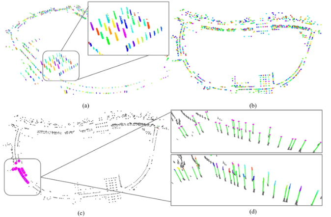

# Ming Cao

Master degree candidate, [NRSL group](http://nrs-lab.com/)

School of Mechanical Engineering and Automation

Networked Robotics and Systems Lab

Harbin Institute of Technology, Shenzhen, China

-------------------------

I am a student of School of Mechanical Engineering and Automation in Harbin Institute of Technology, Shenzhen and a member of NRSL group, led by professor Haoyao Chen.

## Biography

I received my B.Sc. degree in Electrical Engineering in School of Mechanical and Electrical Engineering from [University of Electronic Science and Technology of China](https://www.uestc.edu.cn/) in June 2019.

## Projects

<h5>&nbsp;&nbsp;&nbsp;&nbsp;&nbsp;Active Reconstruction for Buildings by Mobile Robots</h5>
&nbsp;&nbsp;&nbsp;&nbsp;&nbsp; 2020.10 - now  
&nbsp;&nbsp;&nbsp;&nbsp;&nbsp; Generate Viewspace from frontier extraction.  
&nbsp;&nbsp;&nbsp;&nbsp;&nbsp; Evaluate views by raycasting and gaussian process inference.  
&nbsp;&nbsp;&nbsp;&nbsp;&nbsp; Path planing in a receding horizon strategy.  

---

<h5>&nbsp;&nbsp;&nbsp;&nbsp;&nbsp; Construction of Large-scale Semantic Map</h5>
&nbsp;&nbsp;&nbsp;&nbsp;&nbsp; 2020.4 - 2020.10  
&nbsp;&nbsp;&nbsp;&nbsp;&nbsp; Generate semantic point cloud from camera and LiDAR.  
&nbsp;&nbsp;&nbsp;&nbsp;&nbsp; Use a 2D CNN architecture to relocalization.  

----

<h5>&nbsp;&nbsp;&nbsp;&nbsp;&nbsp; Intelligent Unmanned Logistics Vehicle in Campus</h5>
&nbsp;&nbsp;&nbsp;&nbsp;&nbsp; 2018.9 - 2019.10 <a href="https://www.bilibili.com/video/BV1Sb411H751/">[Video]</a> 
&nbsp;&nbsp;&nbsp;&nbsp;&nbsp; Localization, mapping and navigation of unmmanned vehicle in campus.  
&nbsp;&nbsp;&nbsp;&nbsp;&nbsp; Cooperated with seniors.  

----

<h5>&nbsp;&nbsp;&nbsp;&nbsp;&nbsp;  ROBOCON 2017 </h5>
&nbsp;&nbsp;&nbsp;&nbsp;&nbsp; 2016.9 - 2017.6 <a href="https://www.bilibili.com/video/BV1cW41137a9">[Video]</a> 
&nbsp;&nbsp;&nbsp;&nbsp;&nbsp; Leader of vision group in the robot team of UESTC.  
&nbsp;&nbsp;&nbsp;&nbsp;&nbsp; Design algorithms for tracking frisbees and predict its trajectory.  
&nbsp;&nbsp;&nbsp;&nbsp;&nbsp; Second place in China.  

-----------

## Publication

<h5>&nbsp;&nbsp;&nbsp;&nbsp;&nbsp; Pole-like Objects Mapping and Long-Term Robot Localization in Dynamic Urban Scenarios</h5>
&nbsp;&nbsp;&nbsp;&nbsp;&nbsp; Zhihao Wang, Silin Li, <b>Ming Cao</b>, Haoyao Chen and Yunhui Liu   
&nbsp;&nbsp;&nbsp;&nbsp;&nbsp;&nbsp;arXiv, 2021 <a href="https://arxiv.org/abs/2103.13224">[pdf]</a> <a href="https://github.com/HITSZ-NRSL/long-term-localization">[code]</a>

---

<h5>&nbsp;&nbsp;&nbsp;&nbsp;&nbsp; 3D Dense Rangefinder Sensor With A Low Cost Scanning Mechanism</h5>
<b>&nbsp;&nbsp;&nbsp;&nbsp;&nbsp; Ming Cao</b>, Pengpeng Su, Haoyao Chen*, Shiyu Tang, and Yunhui Liu   
&nbsp;&nbsp;&nbsp;&nbsp;&nbsp;&nbsp;IEEE Transactions on Instrumentation & Measurement（TIM）, 2020 <a href="https://ieeexplore.ieee.org/abstract/document/9166528/">[pdf]</a> 

----------

## Patent

1. 《一种基于三维激光增稠机构的多帧融合方法》，申请号：CN110118974A，2019